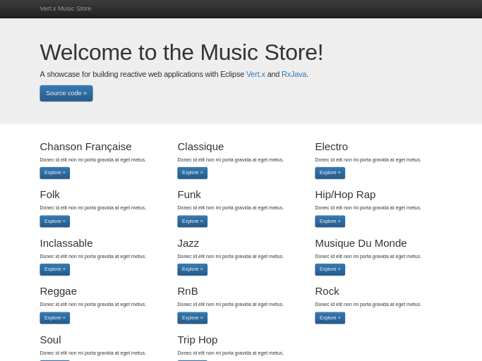
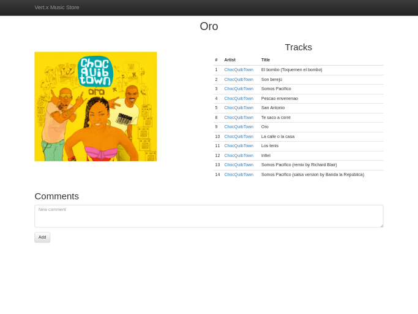
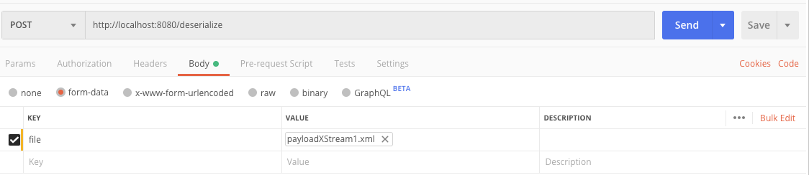
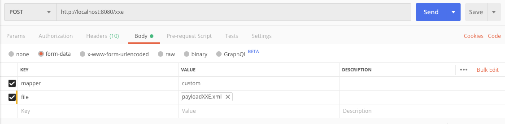
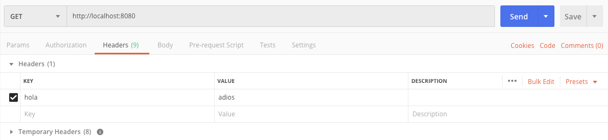

= The Music Store
:figure-caption!:

A demo Music Store with Eclipse Vert.x and RxJava

[cols=2,frame=none,grid=none]
|===

a|
:figure-caption!:
.Welcome Page

a|
:figure-caption!:
.Album page

|===

== Runnning

If you only want to try the application without modifying it, run the build and start the components with `docker-compose`.

[source,shell]
----
mvn clean package
docker-compose up
----

When all components are up browse to http://localhost:8080.

Otherwise start each component individually.

=== The Postgres database

[source,shell]
----
docker run --rm --name musicstore-db -e POSTGRES_USER=music -e POSTGRES_PASSWORD=music -e POSTGRES_DB=musicdb -p 5432:5432 postgres
----

=== The MongoDB server

[source,shell]
----
docker run --rm --name musicstore-mongo -p 27017:27017 mongo
----

=== Development

* Do one time build to pull the dependencies `mvn clean install`
* To run the application in foreground do `mvn vertx:run` with redeploy enabled
* To run the applicaiton in background mode i.e. vertx start do `mvn vertx:start`

Check https://reactiverse.io/vertx-maven-plugin/[vertx-maven-plugin] for more information and
examples on the plugin.

== Useful stuff

=== Initial dataset

The initial dataset has been created with the `initdb.groovy` script located at the project root.
It parses a https://wiki.gnome.org/Apps/Rhythmbox[Rhythmbox] database file and inserts the data into Postgres.

Then it's easy to create a script for Flyway.

[source,shell]
----
docker exec musicstore-db pg_dump -a --inserts --exclude-table=schema_version -h 127.0.0.1 -U music musicdb > src/main/resources/db/migration/V2__InsertData.sql
----

=== Install HDIV Agent

* Copy agent jar to hdiv/agent folder.
* Copy Hdiv license to hdiv/conf folder

=== Vulnerable end-points

==== SQl Injection

Threre are two sql injection vulnerable endpoints:
* http://localhost:8080/artists/163?hack=1%20and%201=1
* Threre is an endpoint which you could download artists data in CSV file. You should filter by artistid parameter: http://localhost:8080/api/csv?artistId=1 union select 1,1,1,1,1,1,username, password from users

==== Path traversal

There is an endpoint through which you can read remote files on the server. User parameter "filename" to set the path and name of the file to read.

http://localhost:8080/pathtraversal?filename=/Users/montero/Documents/desarrollo/labs2/vertx/vertx-vulnerable-musicstore/musicstore/src/main/resources/db/migration/V3__AuthTables.sql

==== Untrusted deserialization

Upload XML files and deserialize with XStream.
There are four example RCE payloads in: src/resources/payloadXStreamXXX.xml
You could try it from postman using url: http://localhost:8080/deserialize

[cols=1,frame=none,grid=none]
|===

a|
:figure-caption!:
.headers Page

|===

==== XXE

Upload XML files and map to java objects.
There is an example RCE payload in: src/resources/payloadXXE.xml
There is an example normal payload in: src/resources/payloadFoo.xml
You could try it from postman using url: http://localhost:8080/xxe.
The xml can be processed by Jackson or SAX. Use parameter "mapper" with values: custom or jackson.

[cols=1,frame=none,grid=none]
|===

a|
:figure-caption!:
.headers Page

|===

==== XPath Injection

Simulate a dummy login process where list of users is in XML.
If endpoint return true, you have access permissions.
If endpoint return false, you don't have access permissions.

* Access granted: http://localhost:8080/xpath?user=neo&pass=trinity
* Access denied: http://localhost:8080/xpath?user=neo&pass=trinityXX
* Access granted: http://localhost:8080/xpath?user=1' or '1'='1&pass=1' or '1'='1

==== Virtual patch

[source,shell]
----
 virtual_patch.attackBlackList.XX={"ip"\:null,"uri"\:null,"headers"\:{"hola"\:"\=\=adios"},"cookies"\:null,"queryString"\:null,"maxRequestNumber"\:0,"windowDurationSeconds"\:1,"appName"\:null,"byteCodePatch"\:false}
 virtual_patch.attackBlackListDesc.XX=MyPatch
----

[cols=1,frame=none,grid=none]
|===

a|
:figure-caption!:
.headers Page

|===
